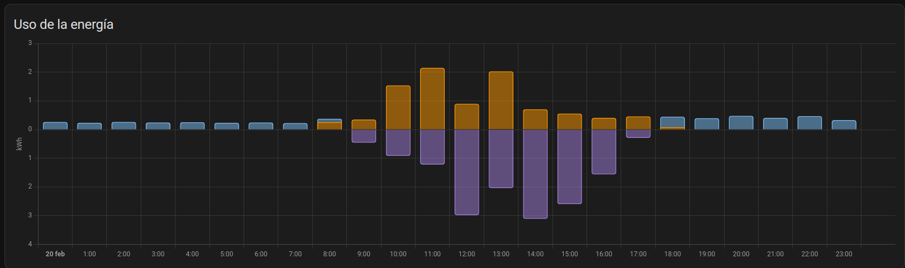

# Componente Balance Neto para Home Assistant

## ¿Qué es el balance neto?

En España, los usuarios de placas fotovoltáicas con compensación de excedentes disponen del balance neto horario el cual
calcula el resultado final de importación y exportación cada hora y en base a este se le factura.

Dicho más sencillo: Si en una hora exportas 3kWh e importas 1kWh, simplemente se considerará que has exportado 2kWh.

Dado que la exportación siempre será más barata que la importación, esto supone un ahorro importante para el usuario.

### Ejemplo:

Supongamos que importar cuesta 0.15€/kWh y exportar nos descuenta 0.11€/kWh, en el primer caso exportamos 3 e importamos 1, en el segundo al revés.

#### Sin Balance
`1 * 0.15 - 3 * 0.11 = 0.18`

`3 * 0.15 - 1 * 0.11 = 0.34`

#### Con balance
`1 - 3 = -2 => -2 * 0.11 = -0.22`

`3 - 1 = 2 => 2 * 0.15 = 0.30`

Como vemos, en ambos casos el balance neto beficia al usuario.

## ¿Qué hace este componente?

Este componente va calculando tu balance horario actual así como el resultado al final de la hora.

Para ello, debes indicar los kWh totales importados y exportados de tu inversor  y el componente creará tres entidades nuevas:

- Importación Neta
- Exportación Neta
- Balance Horario Actual

Después podrás usar Importación Neta y Exportación Neta en el panel de Energía para que Home Assistant haga los calculos correctamente.

### Sin balance neto

### Con Balance

## Instalación
Puedes instalar el componente usando HACS, para ello basta con añadir este repositorio a los repositorios personalizados y buscarlo escribiendo «balance».

## Configuración

Una vez instalado, ve a _Dispositivos y Servicios -> Añadir Integración_ y busca _Balance_.

El asistente te solicitará 2 entidades: kWh totales consumidos y kWh totales exportados.

## Uso
Una vez configurado el componente, usa como sensor de _consumo de red_ «Importación Neta» y _volcar a la red_ «Expotación Neta». 

>#### :warning: Si ya tienes histórico de datos en HA, al cambiar los sensores los datos antiguos dejarán de mostrarse. Si quieres mantener los datos tendrás que conectarse a la base de datos y copiar/actualizar los registros antiguos de importación/exportación a los de importación neta y exportación neta..

## Activar dispositivos cuando hay excedentes

Gracias a la entidad de Balance Horario Actual podrás activar y desactivar dispositivos de alto consumo, como termos eléctricos, para aprovechar al máximo
los excedentes. 

En vez de usar reguladores de potencia para adaptar el consumo a tu producción actual, puedes encender y apagar el dispositivo según el valor
del balance. Por ejemplo encender el termo/AC cuando sea el balance neto sea superior a 0.2kWh y apagarlo cuando sea inferior a -0.05kWh. 

De esta forma evitamos bajar la potencia al pasar una nube de forma puntual o no encender nunca un dispositivo de 1500W si nuestros excedentes son de 750W cuando podríamos tenerlo media hora encendido sin problema.
